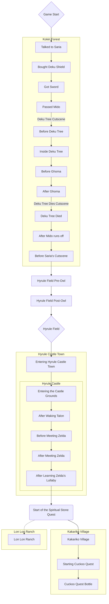

# Save Tree Graph
Click on a node below to go to its save files folder.

```mermaid
flowchart TD
	000000{Game Start} --> 000100
	click 000000 href "https://github.com/tustin2121/OoTR-saveTree/blob/main/saves/000000_GameStart"
	
	subgraph G01 [Kokiri Forest]
		000100[Talked to Saria] --> 000210 
		click 000100 href "https://github.com/tustin2121/OoTR-saveTree/blob/main/saves/000100_PostSaria"
		
		000210[Bought Deku Shield] --> 000220
		click 000210 href "https://github.com/tustin2121/OoTR-saveTree/blob/main/saves/000210_DekuShield"
		
		000220[Got Sword] --> 000250
		click 000220 href "https://github.com/tustin2121/OoTR-saveTree/blob/main/saves/000220_KokiriSword"
		
		000250[Passed Mido] -- Deku Tree Cutscene --> 000300
		click 000250 href "https://github.com/tustin2121/OoTR-saveTree/blob/main/saves/000250_PastMido"
		
		000300[Before Deku Tree] --> 000310
		click 000300 href "https://github.com/tustin2121/OoTR-saveTree/blob/main/saves/000300_BeforeDeku"
		
		000310[Inside Deku Tree] --> 000400
		click 000310 href "https://github.com/tustin2121/OoTR-saveTree/blob/main/saves/000310_InsideDeku"
		
		000400[Before Ghoma] --> 000450
		click 000400 href "https://github.com/tustin2121/OoTR-saveTree/blob/main/saves/000400_BeforeGhoma"
		
		000450[After Ghoma] -- Deku Tree Dies Cutscene --> 000500
		click 000450 href "https://github.com/tustin2121/OoTR-saveTree/blob/main/saves/000450_AfterGhoma"
		
		000500[Deku Tree Died] --> 000510
		click 000500 href "https://github.com/tustin2121/OoTR-saveTree/blob/main/saves/000500_DekuDead"
		
		000510[After Mido runs off] --> 000520
		click 000510 href "https://github.com/tustin2121/OoTR-saveTree/blob/main/saves/000510_PostMido"
		
		000520[Before Saria's Cutscene]
		click 000510 href "https://github.com/tustin2121/OoTR-saveTree/blob/main/saves/000520_PreSaria"
	end
	G01@{  }
	
	001100[Hyrule Field Pre-Owl] --> 001110
	000520 --> 001100
	click 000520 href "https://github.com/tustin2121/OoTR-saveTree/blob/main/saves/001100_HFPreOwl"
	
	001110[Hyrule Field Post-Owl] --> 001150
	click 001110 href "https://github.com/tustin2121/OoTR-saveTree/blob/main/saves/001110_HFPostOwl"
	
	001150{Hyrule Field} --> 002000
	click 001150 href "https://github.com/tustin2121/OoTR-saveTree/blob/main/saves/001150_HyruleField"
	
	subgraph G02 [Hyrule Castle Town]
		002000[Entering Hyrule Castle Town] --> 002100
		click 002000 href "https://github.com/tustin2121/OoTR-saveTree/blob/main/saves/002000_CastleTown"
		
		subgraph G03 [Hyrule Castle]
			002100[Entering the Castle Grounds] --> 002110
			click 002100 href "https://github.com/tustin2121/OoTR-saveTree/blob/main/saves/002100_CastleEnter"
			
			002110[After Waking Talon] --> 002200
			click 002110 href "https://github.com/tustin2121/OoTR-saveTree/blob/main/saves/002110_TalonWoken"
			
			002200[Before Meeting Zelda] --> 002210
			click 002200 href "https://github.com/tustin2121/OoTR-saveTree/blob/main/saves/002200_BeforeZelda"
			
			002210[After Meeting Zelda] --> 002220
			click 002210 href "https://github.com/tustin2121/OoTR-saveTree/blob/main/saves/002210_AfterZelda"
			
			002220[After Learning Zelda's Lullaby]
			click 002220 href "https://github.com/tustin2121/OoTR-saveTree/blob/main/saves/002220_ZLLearned"
		end
	end
	
	003000(Start of the Spiritual Stone Quest) --> 003100
	002220 --> 003000
	click 003000 href "https://github.com/tustin2121/OoTR-saveTree/blob/main/saves/003000_StoneQuest"
	
	subgraph G04 [Kakariko Village]
		003100[Kakariko Village] --> 003110
		click 003100 href "https://github.com/tustin2121/OoTR-saveTree/blob/main/saves/003100_KakarikoEnter"
		
		003110[Starting Cuckoo Quest] --> 003112
		click 003110 href "https://github.com/tustin2121/OoTR-saveTree/blob/main/saves/003110_CuckooQuest1"
		
		003112[Cuckoo Quest Bottle]
		click 003112 href "https://github.com/tustin2121/OoTR-saveTree/blob/main/saves/003112_CuckooQuest2"
	end
	
	
	
	
	
	
	
	
	
	subgraph G90 [Lon Lon Ranch]
		003900[Lon Lon Ranch]
		click 003100 href "https://github.com/tustin2121/OoTR-saveTree/blob/main/saves/001150_HyruleField"
	end
	003000 -.-> 003900
```
