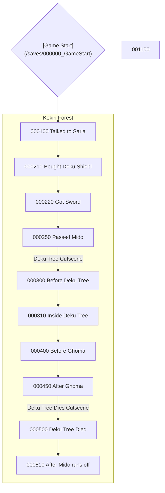

```mermaid
flowchart TD
	000000{"`[Game Start](/saves/000000_GameStart)`"} --> 000100
	subgraph G01 [Kokiri Forest]
		000100[000100 Talked to Saria]        --> 000210
		000210[000210 Bought Deku Shield]     --> 000220
		000220[000220 Got Sword]              --> 000250
		000250[000250 Passed Mido]            -- Deku Tree Cutscene --> 000300
		000300[000300 Before Deku Tree]       --> 000310
		000310[000310 Inside Deku Tree]       --> 000400
		000400[000400 Before Ghoma]           --> 000450
		000450[000450 After Ghoma]            -- Deku Tree Dies Cutscene --> 000500
		000500[000500 Deku Tree Died]         --> 000510
		000510[000510 After Mido runs off]
	end
	G01@{  }
	001100[001100 ]
```
